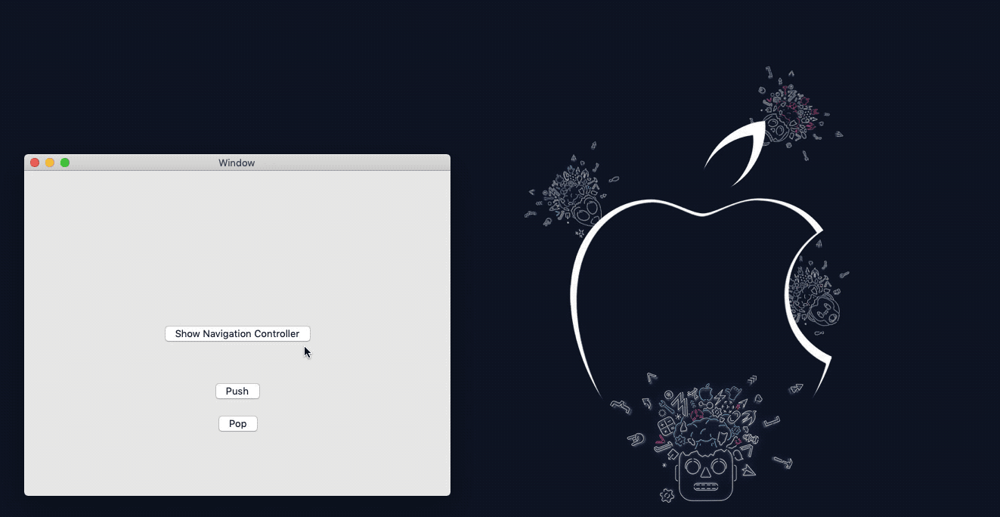

# HCNavigationController

UINavigationController alike, macOS





### How to use

``` Swift
    let navigationController = HCNavigationController(withFrame: NSApp.keyWindow!.frame, rootViewController: nil)
    let window = NSWindow(contentViewController: self.navigationController!)
    window.makeKeyAndOrderFront(nil)


    // Push
    let vc = TestViewController(nibName: "TestViewController", bundle: nil)
    navigationController.pushViewController(vc, animated: true)

    // Pop
    navigationController?.popViewController(vc, animated: true)
```


### Under the hood

    Actually, we just transition between two subviews.

    Arrange from and to horizontally. Then slide the whole one from left for Push, right for Pop

                        Push
     ◀─ ─ ─ ─ ─ ─ ─ ─ ─ ─ ─ ─ ─ ─ ─ ─ ─ ─ ─ ─
     ┌ ─ ─ ─ ─ ─ ─ ─ ─ ─ ┐ ┌ ─ ─ ─ ─ ─ ─ ─ ─ ─ ┐
     
     │                   │ │                   │
     
     │                   │ │                   │
     
     │       From        │ │        To         │
     
     │                   │ │                   │
     
     │                   │ │                   │
     
     └ ─ ─ ─ ─ ─ ─ ─ ─ ─ ┘ └ ─ ─ ─ ─ ─ ─ ─ ─ ─ ┘
     ─ ─ ─ ─ ─ ─ ─ ─ ─ ─ ─ ─ ─ ─ ─ ─ ─ ─ ─ ▶
                        Pop

For transition fluently, we snapshot from view and to view to placeholder, which hide all the remove/add actions.

And, like `drawViewHierarchyInRect:afterScreenUpdates` in iOS, NSView support similar method like below:

``` Swift
extension NSView {
    func snapshot() -> NSImage? {
        // Returns a bitmap-representation object suitable for caching the specified portion of the view.
        guard let bitmapRep = bitmapImageRepForCachingDisplay(in: bounds) else { return nil }
        cacheDisplay(in: bounds, to: bitmapRep)
        let image = NSImage()
        image.addRepresentation(bitmapRep)
        bitmapRep.size = bounds.size
        return image
    }
}
```